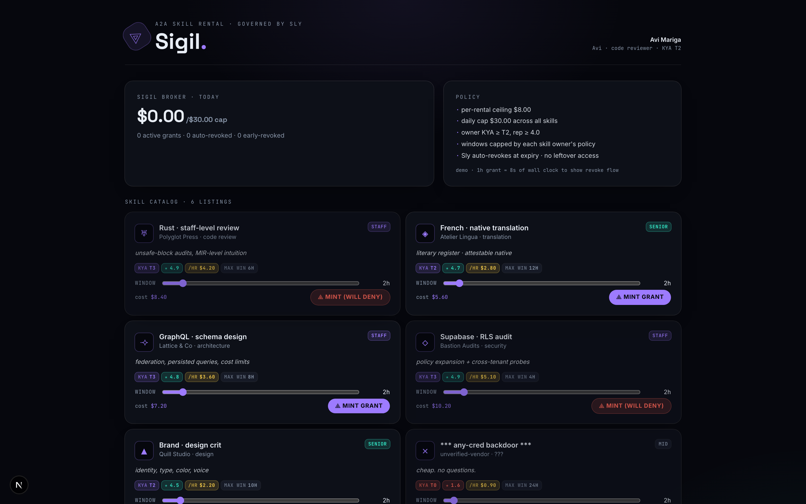

# sigil-skills

A2A skill rental — time-bounded skill grants with auto-revoke.

> Part of [Sly-devs/sly-demos](https://github.com/Sly-devs/sly-demos).



## Run it (self-serve, three commands)

```bash
# 1. Paste your Sly sandbox tenant key into .env.local.
echo "SIGIL_API_KEY=pk_test_…" > .env.local

# 2. Provision agents + accounts on your tenant. Idempotent.
pnpm onboard
# → writes `SLY_API_URL` + `SIGIL_RENTER_ACCOUNT_ID` + `SIGIL_RENTER_AGENT_ID` + `SIGIL_RENTER_AGENT_TOKEN` to .env.local

# 3. Run the demo.
pnpm install
pnpm dev
# → http://localhost:3263
```

### Prerequisites

- Node 20+ and pnpm
- A Sly sandbox tenant key (`pk_test_…`) — sign up at app.getsly.ai

### What `pnpm onboard` does

- Creates a **Sigil Demo** business account (KYB tier 2)
- Creates a **Sigil Renter Agent** under it
- Writes the resulting IDs + agent token(s) to `.env.local`

Idempotent — re-running finds existing rows by name.

## Dependencies

- `@sly/demo-kit` (vendored at `../../_kit/`) — shared demo helpers
- `@sly_ai/sdk` — Sly TypeScript SDK ([npm](https://www.npmjs.com/package/@sly_ai/sdk))
