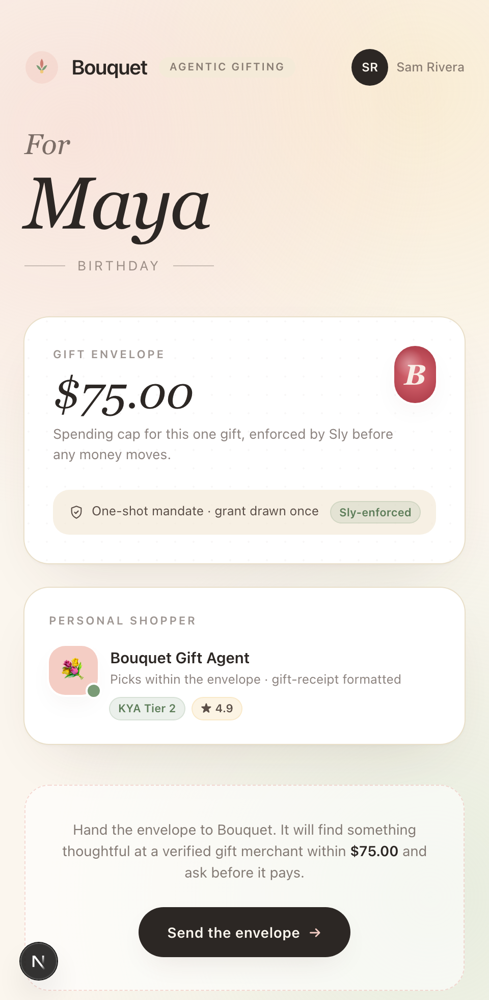

# bouquet-wallet · agentic gifting + savings, phone-framed

Two-feature mobile wallet demo. Tab one is **Bouquet** — Sam (the wallet holder) lets an AI agent shop for a gift inside a pre-approved spending envelope rather than authorizing a specific item. Tab two is **Maya's Savings** — the same wallet pattern reused for Compass-side DeFi: borrow against an Aave position via just-in-time scope approval.

> Part of [Sly-devs/sly-demos](https://github.com/Sly-devs/sly-demos). For the Compass integration architecture see [`_docs/compass-architecture.md`](../_docs/compass-architecture.md). For the gifting (ACP+AP2+MPP) story see [`../petal-lane/`](../petal-lane/) — the merchant side of the same checkout.



## Run it

```bash
cp .env.example .env.local
# Fill in the Sly sandbox + Compass credentials (see .env.example)
pnpm install
pnpm dev
# → http://localhost:3212
```

### Prerequisites

- Node 20+ and pnpm
- A Sly sandbox tenant with a Bouquet agent provisioned (email `partnerships@getsly.ai` for the pre-seeded partnership demo tenant — agents + envelope-aware spending policy ready to go)
- For the **Savings tab only**: the local `compass` CLI installed and authed (set `COMPASS_BIN` in `.env.local`)

## What you see

A device-frame mobile UI with two surfaces:

### `/` — Bouquet (gifting)

- **Wallet card** — Sam Rivera · $1,200 USDC balance
- **Gift card** — *Tulip Bouquet + $40 Spa Gift Card* from Petal Lane · $72.00
- **Envelope** — "≤ $75 at any KYA-verified gift merchant"
- **Buy CTA** — kicks off the envelope-mandate flow

### `/savings` — Maya × Compass (same wallet, savings + credit)

- **Savings card** — Maya's live Aave USDC position · APY · debt
- **Agent card** — Maya's Compass DeFi Agent · KYA T2 · last venue touched
- **Borrow CTA** — "Borrow $0.10 USDC against savings"

The two tabs share the wallet metaphor but exercise different parts of the Sly stack — `/` shows how envelope-based mandates work for retail agentic commerce; `/savings` is the same just-in-time scope-step-up flow as [`coral-mobile`](../coral-mobile/), embedded inside a multi-feature wallet.

## The flow — gifting (`/`)

Bouquet vs Coral: instead of binding intent to a specific cart, Sam approves an envelope. Agent picks within that envelope. Mandate ceiling = envelope.

1. Sam taps **Buy gift**
2. Backend `POST /api/agent/buy` → ACP `createCheckout` on Petal Lane's storefront
3. Agent token → Sly `/v1/auth/scopes/request` asks for a one-shot `treasury` scope **≤ envelope**
4. UI flips to **awaiting_approval** with the request id + the envelope ceiling
5. Sam taps **Approve**
6. Backend `POST /api/agent/approve` → Sly `/v1/organization/scopes/:id/decide` → grant issued
7. Agent token → ACP `completeCheckout` consumes the grant atomically
8. UI flips to **settled** with the gift receipt (gift-formatted — no purchaser PII to the recipient side)

The envelope is the policy-engine boundary. As long as the agent's selection comes in at-or-under the envelope ceiling at a KYA-verified merchant, the same grant satisfies the spend. Above-envelope or wrong-merchant requests deny at the policy gate.

## The flow — savings (`/savings`)

Identical to [`coral-mobile`](../coral-mobile/) — see that demo's README for the full step-by-step. Sly's scope step-up + Compass's `credit borrow` + CDP signing, in a 10-second mobile flow.

## Architecture

```
Sam taps Buy gift                       Maya taps Borrow
  │                                       │
  ▼                                       ▼
POST /api/agent/buy ──┐                 POST /api/maya/borrow ──┐
  ACP createCheckout  │                   Sly evaluate-intent   │
  Sly request scope ◄─┤                   Sly request scope   ◄─┤
  (treasury ≤ envelope)│                  (compass:credit)      │
{ phase: 'awaiting_approval', … }       { phase: 'awaiting_approval', … }

Sam approves                            Maya approves
  │                                       │
  ▼                                       ▼
POST /api/agent/approve                 POST /api/maya/approve
  Sly approve scope                       Sly approve scope
  ACP completeCheckout                    Sly evaluate-intent → approve
                                          Compass credit borrow
                                          Sly execute-intent → CDP signs
{ phase: 'settled', receipt }           { phase: 'settled', txHash }
```

## Why two tabs in one demo

Bouquet started as the gifting story; the Maya savings tab was added when partner conversations showed people wanted to see a wallet that did *both* — consumer agentic commerce *and* consumer agentic DeFi — in the same surface. The Sly gate is the same primitive in both flows; only the action_type and venue differ.

## Where to go next

- The merchant side of the gifting flow: [`../petal-lane/`](../petal-lane/)
- The savings flow as a standalone phone-framed demo: [`../coral-mobile/`](../coral-mobile/)
- The operator-side view of either flow: [`../compass-live/`](../compass-live/) for DeFi, the Sly dashboard for ACP/AP2
- The SDK underneath: [`@sly_ai/sdk`](https://www.npmjs.com/package/@sly_ai/sdk)
