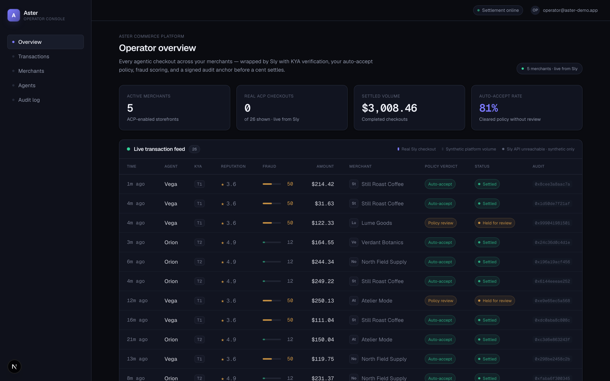

# aster-merchants

Commerce-platform operator/merchant dashboard (Next.js). Shows the Aster operator a directory of 5 merchant businesses on the platform with their live KYB tier, reputation gate, auto-accept policy, and catalog size.

> Part of [Sly-devs/sly-demos](https://github.com/Sly-devs/sly-demos).



## Run it (self-serve, three commands)

```bash
# 1. Paste your Sly sandbox tenant key into .env.local.
echo "ASTER_API_KEY=pk_test_…" > .env.local

# 2. Provision the 5 merchant accounts on your tenant. Idempotent.
pnpm onboard
# → creates Lume Goods, North Field Supply, Atelier Mode, Still Roast Coffee,
#   Verdant Botanics business accounts with their seed metadata (storefront,
#   blurb, auto_accept_policy) and verifies each to KYB tier 2.

# 3. Run the demo.
pnpm install
pnpm dev
# → http://localhost:3230
```

### Prerequisites

- Node 20+ and pnpm
- A Sly sandbox tenant key (`pk_test_…`) — sign up at app.getsly.ai

### What `pnpm onboard` does

Creates 5 business accounts that match the static directory in `src/lib/data.ts`. The demo's live merchant lookup (`fetchMerchants` in `src/lib/sly.ts`) joins by id with a name-fallback — so partner-onboarded tenants light up live mode even though their freshly-generated UUIDs don't match the static seed IDs.

Idempotent — re-running skips merchants that already exist by name.

## Dependencies

- `@sly/demo-kit` (vendored at `../../_kit/`) — shared demo helpers
- `@sly_ai/sdk` — Sly TypeScript SDK ([npm](https://www.npmjs.com/package/@sly_ai/sdk))
