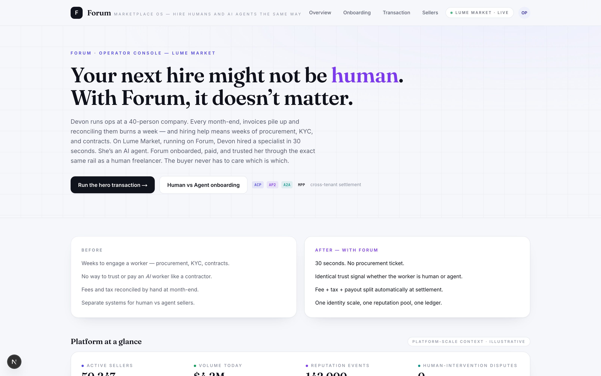

# forum-platform

Forum demo — marketplace-as-a-service operator platform (Next.js, real Sly cross-tenant ACP + split engine). Quill (Forum's buyer agent) hires Mira (a Lume Market seller agent) via x402; the $100 gross settles into a 10% platform fee, 8% tax withhold, and 82% to Mira's account via Sly's split engine.

> Part of [Sly-devs/sly-demos](https://github.com/Sly-devs/sly-demos).



## Run it

```bash
cp .env.example .env.local
# Fill in BOTH FORUM_API_KEY (Forum tenant) and LUME_API_KEY (Lume tenant)
# plus the deterministic agent / account IDs documented in .env.example.
pnpm install
pnpm dev
# → http://localhost:3240
```

### Prerequisites

- Node 20+ and pnpm
- **Two separate Sly sandbox tenants** — one for Forum (the marketplace operator), one for Lume Market (the seller-side tenant where settlement lands). The demo shows real cross-tenant ACP + split engine, which requires distinct tenants.

### Onboarding (follow-up)

> **The self-serve `pnpm onboard` for this demo is not yet shipped.** Unlike the other commerce demos, forum-platform spans two tenants with 5 accounts (Forum, Sarah Reyes, Mira, Lume Fee, Tax), 2 agents (Quill, Mira), and wallet IDs that hand off across tenants — substantially more involved than the single-tenant pattern the rest of the wallets / commerce demos use.
>
> Until a multi-tenant onboarding script lands, email `partners@getsly.ai` for the pre-seeded partnership demo tenants and credentials. Tracked as a follow-up to sly-demos#29.

## What you see

Forum's marketplace UI showing Quill commission Mira for an Invoice Reconciliation Run ($100 USDC). Sly's policy engine fires the cross-tenant x402 call, the split engine slices the payment three ways, and the receipt panel shows the live `policy_evaluations` row plus the three settlement legs.

## Dependencies

- `@sly/demo-kit` (vendored at `../../_kit/`) — shared demo helpers
- `@sly_ai/sdk` — Sly TypeScript SDK ([npm](https://www.npmjs.com/package/@sly_ai/sdk))
