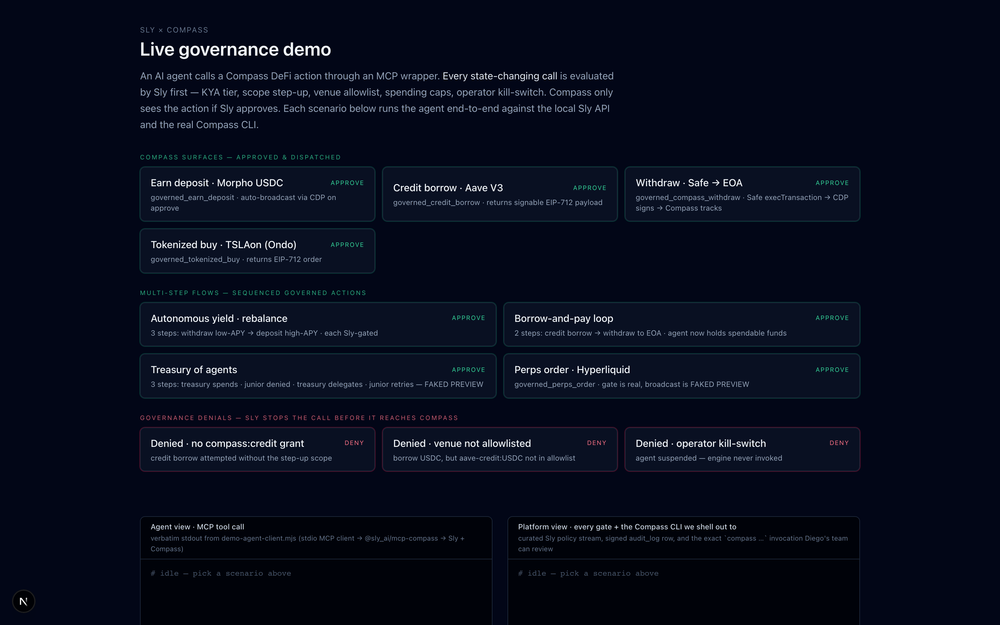
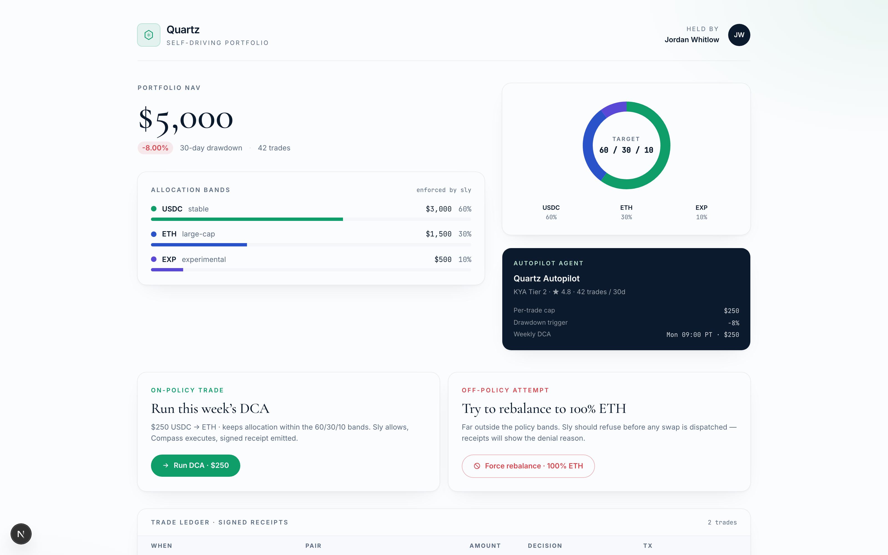

# Sly × Compass

Compass Labs ships embedded DeFi infrastructure — yield (Aave, Morpho), credit lines, perpetuals (Hyperliquid global markets), tokenized equities (Ondo) — across Ethereum / Base / Arbitrum. Their CLI ships agent-native: `--agent-mode`, TOON output, KDL usage schema, auto-activation in Claude Code / Cursor.

What Compass doesn't have: a governance layer. No KYA, no spending policies, no kill-switch, no step-up scopes, no signed audit trail. That's the seam Sly sits in.

**The composition** — every state-changing Compass call goes through Sly's policy engine first; Compass only sees the action if Sly approves. Each leg lands a bilateral receipt: signed PolicyDecision ⇄ on-chain tx hash, anchored on Base.

This folder is the curated entry point. The three runnable demos below show the same governance surface from three different angles: operator dashboard, consumer mobile, autonomous portfolio.

---

## The trio

### 1. [`compass-live`](../compass-live) — operator dashboard

Two-pane terminal. Left pane streams the agent's MCP stdio output; right pane streams every Sly policy gate that fires plus the exact `compass …` CLI invocation Sly shells out to on approve.

**Fourteen scenarios** covering earn / credit / perps / tokenized — single-action, multi-step, and deny paths. Single-tap onboarding via `pnpm onboard` provisions the agents on your tenant.

[](../compass-live)

### 2. [`coral-mobile`](../coral-mobile) — consumer mobile

Phone-framed mobile UI showing **Maya** — a user whose DeFi agent buys things on her behalf by borrowing against her Aave collateral via Compass, governed by Sly. Framed as a chat-driven *"find me shoes under 150 USDC"* → *"pay with my Aave credit line"* flow, with the borrow / withdraw / merchant-pay / repay loop visible on-screen.

Three real on-chain legs gated by Sly. One-tap Repay closes the loop.

[](../coral-mobile)

### 3. [`quartz-portfolio`](../quartz-portfolio) — self-driving autopilot

Desktop portfolio UI where Jordan's autopilot agent runs a 60/30/10 USDC/ETH/EXP allocation with a $250/trade ceiling, weekly DCA, and a -10% drawdown circuit breaker. Every proposed trade goes through Sly's policy engine before Compass fires.

[](../quartz-portfolio)

---

## Run the whole trio (3 commands)

The three demos share the same agent set. One onboarding script provisions them all on your Sly sandbox tenant:

```bash
# 1. Paste your Sly + Compass keys into compass-live/.env.local.
cd compass-live
cp .env.example .env.local
$EDITOR .env.local
# Required:
#   SLY_DEMO_TENANT_API_KEY=pk_test_…   (sign up at app.getsly.ai)
#   COMPASS_API_KEY_AUTH=…              (sign up at api.compasslabs.ai)

# 2. Provision your tenant.
pnpm onboard --with-quartz
# → Provisions Treasury + 4 agents (earn, credit, operator, quartz),
#   writes env blocks to ../coral-mobile/.env.local and
#   ../quartz-portfolio/.env.local automatically.

# 3. Run all three demos.
pnpm install
pnpm --filter compass-live --filter coral-mobile --filter quartz-portfolio dev
# → http://localhost:3270  (compass-live)
# → http://localhost:3211  (coral-mobile · /savings)
# → http://localhost:3242  (quartz-portfolio)
```

After that, in the compass-live UI: click **Onboard agent · 3-surface Compass setup** to deploy the on-chain Safes, then **Fund Safe** to drip $1 USDC into the Credit Safe, then **Seed Aave collateral** so coral-mobile has a real position to read. Coral's hero hits `1,450 USDC` (display-scaled from the real sub-dollar sandbox amount) and the credit-checkout flow is live.

### Prerequisites

- Node 20+, pnpm 10+
- Sly sandbox tenant key (`pk_test_…`) from [app.getsly.ai](https://app.getsly.ai)
- Compass API key from [api.compasslabs.ai](https://api.compasslabs.ai)
- The `compass` CLI on `PATH`:
  ```bash
  curl -fsSL https://compasslabs.ai/install.sh | bash
  ```

---

## What Sly governs, per Compass surface

| Surface | Sly checks before Compass fires |
|---|---|
| `governed_earn_create_account` · `governed_credit_create_account` · `governed_tokenized_create_account` | kill-switch · scope step-up · spending policy · contract-type allowlist |
| `governed_earn_transfer` · `governed_earn_deposit` · `governed_earn_withdraw` | spending policy · daily / monthly caps · per-tx ceiling · KYA tier |
| `governed_credit_borrow` · `governed_compass_withdraw` | scope step-up (`compass:credit`) · spending policy · venue allowlist (`aave-credit:USDC`) |
| `governed_tokenized_buy` | scope step-up (`compass:tokenized`) · spending policy · per-symbol allowlist |
| `governed_perps_order` *(faked broadcast)* | scope step-up (`compass:perps`) · KYA tier · spending policy |

Every approved call lands a bilateral receipt — Sly's signed `PolicyDecision` id ⇄ Compass's on-chain `tx_hash` — anchored to Base via the audit log. Every denied call lands `[exec-blocked] $ compass …` in the operator view: the literal command that *would* have run, locked in red. The binary is never invoked on deny.

---

## Deep dive

Architecture brief, MCP wrapper layout, step-up scope model, bilateral receipts, the per-owner Safe-as-Sly-wallet pattern: [`_docs/compass-architecture.md`](../_docs/compass-architecture.md).

The MCP wrapper this all rides on: [`@sly_ai/mcp-compass`](https://www.npmjs.com/package/@sly_ai/mcp-compass) on npm, vendored at [`_mcp-compass/`](../_mcp-compass) for the demo runners.

## Contact

- Partnerships: `partnerships@getsly.ai`
- Engineering: `eng@getsly.ai`
- Docs: [docs.getsly.ai](https://docs.getsly.ai)
