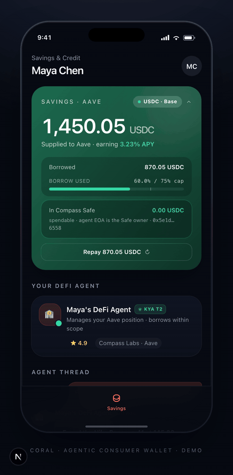

# coral-mobile · Maya × Compass consumer demo

Phone-framed mobile UI showing Maya — a user whose DeFi agent buys things on her behalf by borrowing against her Aave collateral via Compass, governed by Sly. Framed as a chat-driven "find me shoes under $150" → "pay with my Aave credit line" flow, with the borrow / withdraw / merchant-pay / repay loop visible on-screen.

> Part of [Sly-devs/sly-demos](https://github.com/Sly-devs/sly-demos). For the integration architecture, see [`_docs/compass-architecture.md`](../_docs/compass-architecture.md).



## Prerequisites

- Node 20+ and pnpm
- A Sly sandbox tenant key (`pk_test_…`) — sign up at app.getsly.ai
- A Compass API key — sign up at api.compasslabs.ai
- The `compass` CLI on `PATH`. Install: `curl -fsSL https://compasslabs.ai/install.sh | bash` (puts it on `PATH` by default). Override via `COMPASS_BIN` only if you installed it somewhere nonstandard.

## Run it

`.env.local` only needs two real secrets — everything else is derived at runtime from the Sly API. The fastest path is via the sibling `compass-live` demo's onboarding script, which provisions both demos in one call:

```bash
# 1. Provision the tenant + agents.
cd ../compass-live
pnpm onboard
# → writes MAYA_TENANT_KEY + MAYA_AGENT_ID + MAYA_AGENT_TOKEN + the
#   Compass key/bin to ../coral-mobile/.env.local. Idempotent.

# 2. Seed the on-chain state coral-mobile reads.
#    Open http://localhost:3270 (compass-live) and click two scenarios in order:
#       a) Onboard agent · 3-surface Compass setup    — deploys the Compass Safes
#       b) Seed Aave collateral · supply $X USDC      — atomic supply+min-borrow
#    Without these, coral-mobile shows an empty-state hero ("No Aave position
#    yet") because Maya literally hasn't supplied anything to Aave yet.

# 3. Run coral-mobile.
cd ../coral-mobile
pnpm install
pnpm dev
# → http://localhost:3211/savings
```

### What gets derived (and what you don't have to set)

When the dev server boots, coral-mobile calls `GET /v1/agents/:id` and `GET /v1/agents/:id/wallet` against the Sly API and reads:

- **owner EOA** ← agent's external/coinbase wallet
- **parent account id** ← agent's `parentAccountId`
- **Compass Safe address** ← the agent's `smart_wallet` (provider=`compass`) row, populated automatically when you run the **Onboard agent · 3-surface Compass setup** scenario in compass-live

So you do not need to set `MAYA_OWNER_EOA`, `MAYA_ACCOUNT_ID`, or `MAYA_SAFE_ADDRESS` in `.env.local`. You can pin any of them via env to override, but the default-derived values are correct.

If `MAYA_AGENT_ID` is left blank, the demo auto-picks the first active KYA T2 agent whose name contains "Credit" — which matches the Compass Demo Credit Agent that `pnpm onboard` provisions.

### Running standalone

If you only want coral-mobile without compass-live:

```bash
cp .env.example .env.local
# Fill in just MAYA_TENANT_KEY, COMPASS_API_KEY_AUTH.
# Optionally pin MAYA_AGENT_ID if you have more than one credit agent.
pnpm install
pnpm dev
```

You'll still need a real Aave position on the Credit Agent's Safe for the credit-checkout to settle — the easiest way to get one is to run compass-live's two seed scenarios at least once.

## What you see

A device-frame mobile UI on `/savings`:

- **Savings card** — Maya's live Aave position (USDC supplied · APY · outstanding debt · the borrowed asset's balance in the Compass-managed Safe). Tap the header to collapse it down to a one-line summary. Shows an amber empty-state callout if there's no Aave position yet (fresh tenant that hasn't run compass-live's seed scenarios).
- **Your DeFi agent card** — Maya's DeFi Agent (KYA tier 2 · reputation · "Compass Labs · Aave" venue).
- **Agent thread** — a two-sided chat:
  - Maya's outgoing bubble: *"Find me running shoes under 150 USDC."*
  - The agent's reply: *"Found the Nike Pegasus 41 at 145.00 USDC — under your budget. Want me to pay with your Aave credit line?"* with a product hero card (Nike Pegasus 41 · 145.00 USDC).
  - CTA: *"Yes — pay with Aave credit →"*
- **Repay button** (appears whenever debt > 0) — one-tap close-out of the borrowed USDC.

The agent and the position are real. The position card reads via `compass credit positions`; the borrow / withdraw / repay legs execute through Compass after Sly approves; the merchant pay is a real USDC transfer to a peer agent on the same tenant.

### About the on-screen amounts

The sandbox executes deliberately small sub-dollar transactions ($0.10 USDC borrow against ~$1 USDC of Aave collateral), but the UI multiplies displayed amounts by **DEMO_SCALE = 1,450** so the demo lands at human-readable values — *$1,450 in Aave savings*, *$145 Nike Pegasus 41*. The Basescan links go to the real sub-dollar transactions. LTV % and APY are ratios, not scaled.

## The flow

1. Maya taps **Yes — pay with Aave credit**.
2. Backend route `POST /api/maya/credit-checkout` (preflight, no broadcast) builds a `treasury` scope request: agent token → `/v1/auth/scopes/request` → `{ request_id }`. UI transitions to **awaiting_approval**.
3. UI presents a Face-ID-styled approval sheet showing the merchant + amount.
4. Maya taps **Approve & pay**.
5. Backend route `POST /api/maya/credit-checkout/confirm` runs three real on-chain legs sequentially, each independently policy-gated:
   1. **Borrow** — `compass credit borrow` → Sly's executor signs via CDP + broadcasts. USDC lands in the Compass Safe.
   2. **Withdraw** — `compass credit transfer --action WITHDRAW` → moves the USDC from the Safe to Maya's EOA.
   3. **Pay merchant** — hand-built `USDC.transfer(merchant, amount)` executed via `/v1/policy/execute-intent` → CDP signs + broadcasts.
6. UI flips to **settled** with three checkmarks + three Basescan tx links + a summary bubble from the agent ("Done — paid Nike $145.00 USDC from your Aave credit line. Your savings are still earning.")
7. The Repay button appears in the savings card; one tap clears the debt via `POST /api/maya/repay`.

## Architecture

```
Maya types nothing — the agent thread is pre-framed.
She taps Yes — pay with Aave credit.
  │
  ▼
POST /api/maya/credit-checkout ────► Sly: /v1/auth/scopes/request   → request_id (treasury, one-shot)
  ▼
{ phase: 'awaiting_approval', requestId }

Maya taps Approve & pay (Face-ID sheet)
  │
  ▼
POST /api/maya/credit-checkout/confirm
  │
  ├── 1. Borrow ($0.10 USDC against Aave)
  │     evaluate-intent → approve → compass credit borrow → execute-intent (CDP signs + broadcasts)
  │
  ├── 2. Withdraw Safe → EOA
  │     evaluate-intent → approve → compass credit transfer → execute-intent
  │
  └── 3. Pay merchant ($0.10 USDC → operator EOA)
        scope decide (consume treasury grant) → evaluate-intent → execute-intent (manual USDC.transfer)

{ phase: 'settled', receipts: [3× { txHash, evaluationId, blockNumber }], events: [...] }

Later, when Maya taps Repay:
POST /api/maya/repay ──────► position read → top-up Safe if needed → compass credit repay → execute-intent
                              → debt cleared, Repay button disappears
```

The position card (savings supply / APY / debt / Safe balance) reads via `GET /api/maya/position`, which shells `compass credit positions --owner <eoa>` and adds a `balanceOf` RPC call to surface the Compass Safe's actual holdings (Compass routes credit borrows through a per-owner Safe — the borrowed asset lands there, not on the EOA). When the read returns no `collateral_positions`, the route sets `empty: true` and the savings card renders the empty-state hero instead of the seed fallback.

## Where to go next

- The operator-side view of the same machinery: [`../compass-live/`](../compass-live/)
- A 4K walkthrough of the credit-checkout flow lives in `docs/demos/coral-credit-checkout/` in the Sly main repo. The animated cover above shows the page tour; the on-chain flow itself runs in ~30s end-to-end against the sandbox.
- The MCP wrapper underneath: [`@sly_ai/mcp-compass`](https://www.npmjs.com/package/@sly_ai/mcp-compass)
