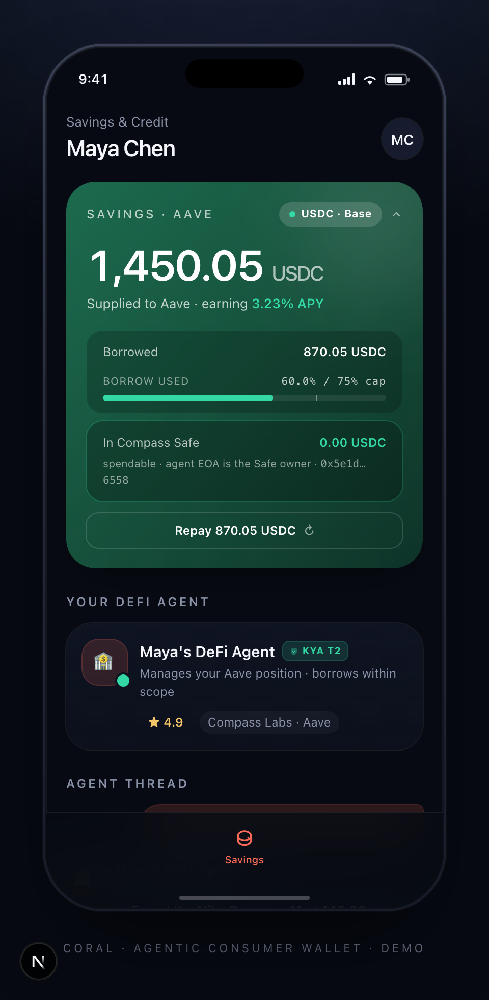

# coral-mobile · Maya × Compass consumer demo

Phone-framed mobile UI showing Maya — a user whose AI agent borrows USDC against her Aave collateral via Compass, governed by Sly.

> Part of [Sly-devs/sly-demos](https://github.com/Sly-devs/sly-demos). For the integration architecture, see [`_docs/compass-architecture.md`](../_docs/compass-architecture.md).



## Prerequisites

- Node 20+ and pnpm
- A Sly sandbox tenant key (`pk_test_…`) — sign up at app.getsly.ai
- A Compass API key — sign up at api.compasslabs.ai
- The `compass` CLI on `PATH`. Install: `curl -fsSL https://compasslabs.ai/install.sh | bash` (puts it on `PATH` by default). Override via `COMPASS_BIN` only if you installed it somewhere nonstandard.

## Run it

`.env.local` only needs two real secrets — everything else is derived at runtime from the Sly API. The fastest path is via the sibling `compass-live` demo's onboarding script, which provisions both demos in one call:

```bash
# From ../compass-live (assumes you've already pasted your Sly + Compass keys
# into ../compass-live/.env.local — see that README).
cd ../compass-live
pnpm onboard
# → writes MAYA_TENANT_KEY + MAYA_AGENT_ID + MAYA_AGENT_TOKEN + the Compass
#   key/bin to ../coral-mobile/.env.local. That's it.

# Then back here:
cd ../coral-mobile
pnpm install
pnpm dev
# → http://localhost:3211/savings
```

### What gets derived (and what you don't have to set)

When the dev server boots, coral-mobile calls `GET /v1/agents/:id` and `GET /v1/agents/:id/wallet` against the Sly API and reads:

- **owner EOA** ← agent's `walletAddress`
- **parent account id** ← agent's `parentAccountId`
- **Compass Safe address** ← the agent's `smart_wallet` (provider=`compass`) row, populated automatically when you run the **Onboard agent · 3-surface Compass setup** scenario in compass-live (Sly's `execute-intent` persists the deployed Safe on every `*_create_account` success)

So you do not need to set `MAYA_OWNER_EOA`, `MAYA_ACCOUNT_ID`, or `MAYA_SAFE_ADDRESS` in `.env.local`. You can pin any of them via env to override, but the default-derived values are correct.

If `MAYA_AGENT_ID` is left blank, the demo auto-picks the first active KYA T2 agent whose name contains "Credit" — which matches the Compass Demo Credit Agent that `pnpm onboard` provisions.

### Running standalone

If you only want coral-mobile without compass-live:

```bash
cp .env.example .env.local
# Fill in just MAYA_TENANT_KEY, COMPASS_API_KEY_AUTH, COMPASS_BIN.
# Optionally pin MAYA_AGENT_ID if you have more than one credit agent.
pnpm install
pnpm dev
```

## What you see

A device-frame mobile UI on `/savings`:

- **Savings card** — Maya's live Aave position (USDC supplied · APY · outstanding debt · the borrowed asset's balance in the Compass-managed Safe)
- **Agent card** — Maya's DeFi Agent (KYA tier 2, reputation, last-touched venue)
- **Borrow CTA** — "Borrow $0.10 USDC against savings"

The agent itself is a real Sly-registered agent on your sandbox tenant. The position card reads via `compass credit positions`; the borrow executes through `compass credit borrow` after Sly approves.

## The flow

1. Maya taps **Borrow $0.10 USDC against savings**
2. Backend route `POST /api/maya/borrow` builds a CompassIntent, posts to Sly's `/v1/policy/evaluate-intent`
3. Sly **denies** — no active `compass:credit` scope grant. Agent calls `/v1/auth/scopes/request` and the page transitions to **awaiting_approval**
4. UI presents an approval card with the request id and the amount (Face-ID-styled flow for the demo)
5. Maya taps **Approve & borrow**
6. Backend route `POST /api/maya/approve` calls `/v1/organization/scopes/:id/decide` → grant issued
7. Re-evaluation → approve → `compass credit borrow …` returns the unsigned Permit2 tx
8. Sly's executor signs via CDP + broadcasts on Base
9. UI flips to **settled** with the on-chain tx hash + bilateral receipt
10. The savings card auto-refreshes — new debt visible, borrowed asset balance appears in the Compass Safe row

The full demo runs in ~10 seconds end-to-end against the sandbox. Real on-chain Base transactions.

## Architecture

```
Maya taps Borrow
  │
  ▼
POST /api/maya/borrow ─────────────► Sly: /v1/policy/evaluate-intent → 403 deny (scope_required)
  │                                  Sly: /v1/auth/scopes/request   → request_id
  ▼
{ phase: 'awaiting_approval', requestId }

Maya taps Approve
  │
  ▼
POST /api/maya/approve ────────────► Sly: /v1/organization/scopes/:id/decide → grant issued
                                     Sly: /v1/policy/evaluate-intent → approve
                                     Compass: credit borrow → unsigned tx
                                     Sly: /v1/policy/execute-intent → CDP signs + broadcasts
                                     ▼
                                     tx_hash on Base, bilateral receipt returned
  ▼
{ phase: 'settled', txHash, blockNumber, events: [...] }
```

The position card (savings supply / APY / debt / Safe balance) reads via `GET /api/maya/position`, which shells `compass credit positions --owner <eoa>` and adds a `balanceOf` RPC call to surface the Compass Safe's actual holdings (Compass routes credit borrows through a per-owner Safe — the borrowed asset lands there, not on the EOA).

## Where to go next

- The operator-side view of the same flow: [`../compass-live/`](../compass-live/)
- The narrated walkthrough: [`recordings/maya-borrow.mp4`](./recordings/maya-borrow.mp4)
- The MCP wrapper underneath: [`@sly_ai/mcp-compass`](https://www.npmjs.com/package/@sly_ai/mcp-compass)
