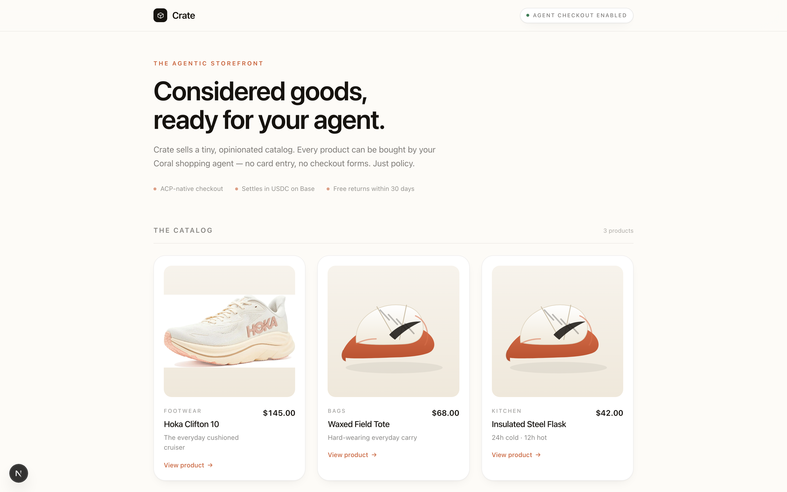

# crate-storefront

'Crate' merchant storefront (Next.js, ACP-enabled). Coral wallet users come through this storefront and the Coral Buyer Agent fires the checkout.

> Part of [Sly-devs/sly-demos](https://github.com/Sly-devs/sly-demos).



## Run it (self-serve, three commands)

```bash
# 1. Paste your Sly sandbox tenant key into .env.local.
echo "CORAL_API_KEY=pk_test_…" > .env.local

# 2. Provision the Coral Demo account + Coral Buyer Agent on your tenant. Idempotent.
pnpm onboard
# → writes SLY_API_URL + CORAL_ACCOUNT_ID + CORAL_AGENT_ID + CORAL_AGENT_TOKEN to .env.local

# 3. Run the demo.
pnpm install
pnpm dev
# → http://localhost:3210
```

### Prerequisites

- Node 20+ and pnpm
- A Sly sandbox tenant key (`pk_test_…`) — sign up at app.getsly.ai

### What `pnpm onboard` does

- Creates a **Coral Demo** business account (KYB tier 2 — sandbox-verified)
- Creates a **Coral Buyer Agent** under it (auto-created wallet, transactions:initiate=true)
- Writes the resulting IDs + agent token to `.env.local`

Idempotent — re-running finds existing rows by name.

> The sibling `petal-lane` demo provisions its own dedicated `Coral Buyer Agent (Petal Lane)` so the two storefronts stay independent.

## Dependencies

- `@sly/demo-kit` (vendored at `../_kit/`) — shared demo helpers
- `@sly_ai/sdk` — Sly TypeScript SDK ([npm](https://www.npmjs.com/package/@sly_ai/sdk))
