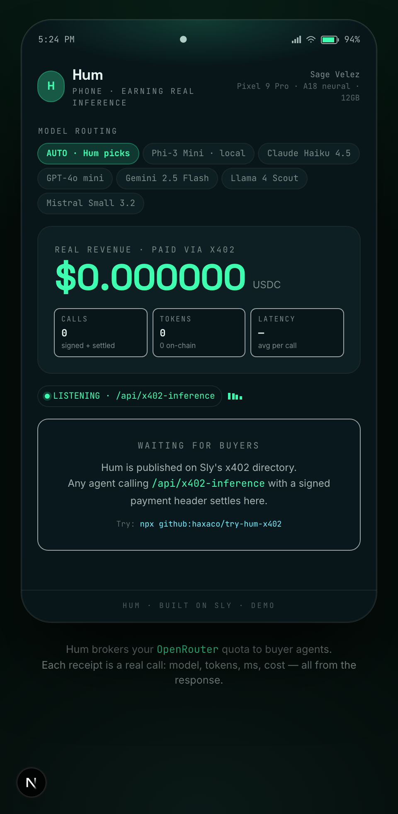

# hum-inference

Sell spare phone NPU cycles — buyer agents pay per call via x402.

> Part of [Sly-devs/sly-demos](https://github.com/Sly-devs/sly-demos).



## Run it (self-serve, three commands)

```bash
# 1. Paste your Sly sandbox tenant key into .env.local.
echo "HUM_API_KEY=pk_test_…" > .env.local

# 2. Provision agents + accounts on your tenant. Idempotent.
pnpm onboard
# → writes `SLY_API_URL` + `HUM_ACCOUNT_ID` + `HUM_SELLER_ACCOUNT_ID` + `HUM_AGENT_ID` + `HUM_RELAY_AGENT_ID` + `HUM_AGENT_TOKEN` to .env.local

# 3. Run the demo.
pnpm install
pnpm dev
# → http://localhost:3260
```

### Prerequisites

- Node 20+ and pnpm
- A Sly sandbox tenant key (`pk_test_…`) — sign up at app.getsly.ai

### What `pnpm onboard` does

- Creates **Hum Buyer Treasury** + **Hum Seller Treasury** business accounts (KYB tier 2)
- Creates **Hum Inference Agent** (the buyer) + **Hum Relay Agent** (the seller)
- Writes the resulting IDs + agent token(s) to `.env.local`

Idempotent — re-running finds existing rows by name.

## Dependencies

- `@sly/demo-kit` (vendored at `../_kit/`) — shared demo helpers
- `@sly_ai/sdk` — Sly TypeScript SDK ([npm](https://www.npmjs.com/package/@sly_ai/sdk))
