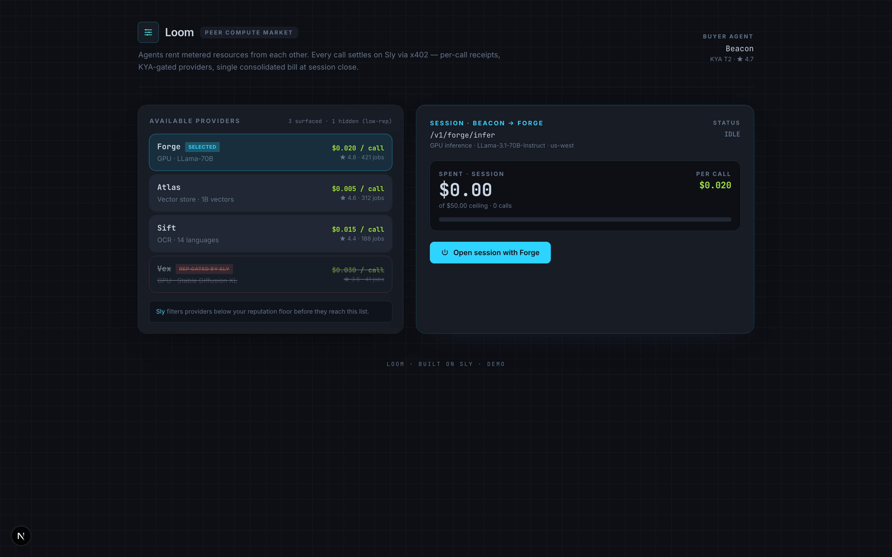

# loom-market
Loom — peer resource market (A2A x402 metered compute rental)
> Part of [Sly-devs/sly-demos](https://github.com/Sly-devs/sly-demos).

## Run it
```bash
cp .env.example .env.local   # fill in your sandbox credentials
pnpm install
pnpm dev
# → http://localhost:3243
```
## Dependencies
This demo runs against a Sly sandbox tenant. Sign up at [sandbox.getsly.ai](https://sandbox.getsly.ai) for credentials.
Some demos additionally depend on:
- `@sly/demo-kit` (vendored at `../_kit/`) — shared demo helpers (event types, broker client)
- `@sly_ai/sdk` — Sly TypeScript SDK ([npm](https://www.npmjs.com/package/@sly_ai/sdk))
See the `package.json` for the exact dependency list.
## Status
Source + screenshot included. Full runnable setup against the public sandbox is rolling out incrementally — email `partnerships@getsly.ai` if you want to demo this one specifically.