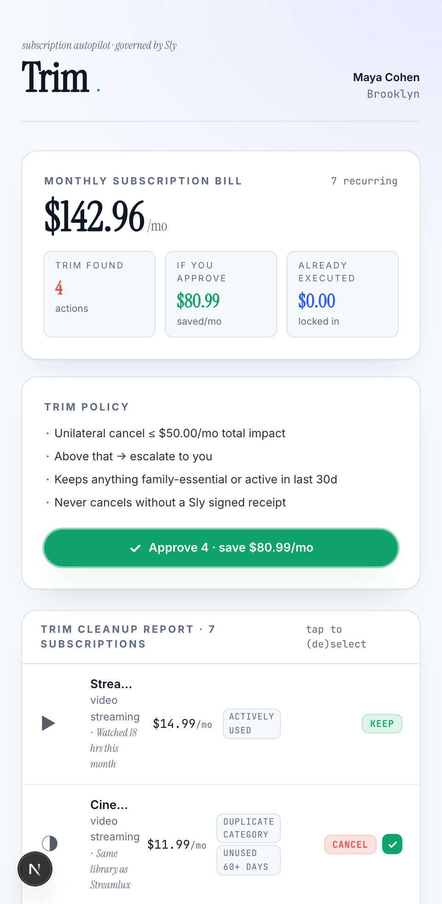

# trim-subs

Trim — subscription autopilot. Finds dupes & unused subs, cancels with one tap.

> Part of [Sly-devs/sly-demos](https://github.com/Sly-devs/sly-demos).



## Run it (self-serve, three commands)

```bash
# 1. Paste your Sly sandbox tenant key into .env.local.
echo "TRIM_API_KEY=pk_test_…" > .env.local

# 2. Provision the Trim Demo account + agent on your tenant. Idempotent.
pnpm onboard
# → writes SLY_API_URL + TRIM_ACCOUNT_ID + TRIM_AGENT_ID + TRIM_AGENT_TOKEN to .env.local

# 3. Run the demo.
pnpm install
pnpm dev
# → http://localhost:3261
```

### Prerequisites

- Node 20+ and pnpm
- A Sly sandbox tenant key (`pk_test_…`) — sign up at app.getsly.ai

### What `pnpm onboard` does

- Creates a **Trim Demo** business account on your tenant (KYB tier 2 — sandbox-verified)
- Creates a **Trim Subscription Agent** under it (KYA tier 1, custom permissions, auto-created wallet)
- Writes the resulting IDs + agent token back to `.env.local` so the dev server picks them up on boot

Idempotent — re-running finds existing rows by name and reuses them.

## Dependencies

This demo runs against a Sly sandbox tenant. Sign up at [sandbox.getsly.ai](https://sandbox.getsly.ai) for credentials.

- `@sly/demo-kit` (vendored at `../../_kit/`) — shared demo helpers
- `@sly_ai/sdk` — Sly TypeScript SDK ([npm](https://www.npmjs.com/package/@sly_ai/sdk))
